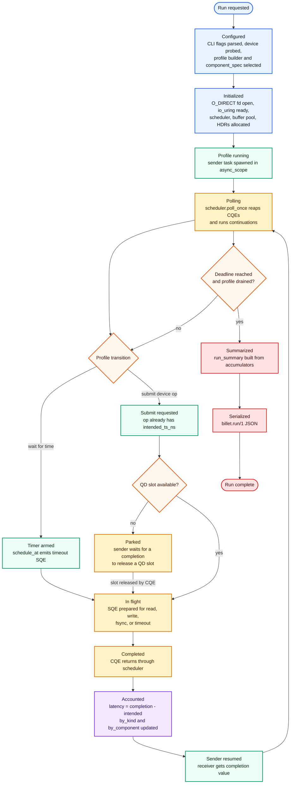

# Sender Engine

billet: function generator and oscilloscope for block devices.

The sender engine is the testbed core. The CLI builds a profile sender, the
engine drives that sender on one `io_uring` worker, and every completed op is
accounted into the same `run_summary` shape the report layer serializes.

## Flow

1. The CLI probes the target device, builds `run_config`, chooses the sender
   profile, and passes the profile's `component_spec` table into the engine.
2. `run_with_senders` opens the block device, initializes the ring and
   scheduler, reserves the aligned buffer pool, allocates HDR histograms, and
   creates `workload_ctx`.
3. The profile runs as an `exec::task<void>`. It uses `schedule_at` for timers
   and `submit_op` for device work. The profile, not the engine, decides the
   operation's `intended_ts_ns`.
4. `workload_ctx` enforces the global `--qd` device-op cap before an op reaches
   the SQ ring. Extra sender states park until a CQE releases a slot.
5. On completion, the engine records `completion_ts_ns - intended_ts_ns` with
   `hdr_record_value`, updates per-kind and per-component counters, releases
   the QD slot, and resumes the waiting sender.
6. When the deadline expires and profile tasks drain, the engine returns a
   `run_summary`. The report layer turns that into `billet.run/1`.

Timers and device I/O intentionally share the same scheduler and CQE polling
loop. That keeps open-loop arrivals, WAL fsync deadlines, checkpoint periods,
and I/O completions on one clock path instead of splitting the testbed across
independent event loops.

## Multi-worker

`--workers N` runs the flow above on N threads at once. Each worker is fully
share-nothing on the I/O hot path: its own `O_DIRECT` fd, `io_uring`, sender
scheduler, aligned buffer pool, and accumulator. The only shared sinks are
`live_stats` (atomic) and the `sisl::metrics` group (URCU-sharded), both built
for concurrent updates. After every worker joins, the per-worker accumulators
merge into one `run_summary` via `hdr_add`, so percentiles compose exactly.

Placement comes from `engine/topology`, which reads the device's blk-mq
hardware queues (`/sys/class/block/<disk>/mq/*/cpu_list`) and NUMA layout from
sysfs. `plan_workers` assigns each worker a cpuset:

- `mq` (default via `auto`): worker `i` pins to the cpuset of a distinct,
  NUMA-local-first hardware queue, so submission spreads across the device's
  I/O queues instead of saturating one core's queue. `--workers 0` auto-sizes
  to the number of NUMA-local queues.
- `numa` / `linear` / `none`: fallbacks for stacked or synthetic devices
  (md, dm, loop) that expose no hardware queues.

The workload, not the engine, decides what fans out. Read/write I/O is
replicated per worker (each worker drives the device independently with its own
RNG stream); WAL and commit are singletons hosted on worker 0 only, modeling
one physical WAL serializing every session. `pg_wal_commit`, being a pure
commit stream, always runs single-worker regardless of `--workers`.

Because the replicated emitters are rate-driven, increasing `--workers` offers
*more* aggregate load rather than spreading a fixed load across more cores: with
the open-loop `postgresql` emitters, offered read/write IOPS scales with the
worker count, and with the closed-loop profiles aggregate inflight is
`workers * qd`. A `--workers` sweep is therefore a capacity sweep, not a
fixed-load A/B; to isolate submission placement at constant load, hold
`--workers` fixed and vary `--pin-strategy`.
