# Workload Profiles

billet: function generator and oscilloscope for block devices.

These notes describe billet's sender-based profile model.

In the sender model, a profile is an `exec::task<void>` that receives a
`billet::engine::workload_ctx`. The profile decides when to issue operations,
then calls `co_await ctx.submit_op(op)` or spawns that sender into an
`exec::async_scope` when it wants fire-and-drain behavior. Timers go through
`ctx.scheduler().schedule_at(...)`, so sleeps and I/O completions are both
driven by the worker's `io_uring` CQE loop.

`workload_ctx` also owns sender-side queue-depth backpressure. Profiles can
spawn more coroutines than `--qd`; only `--qd` device ops are allowed into the
ring at a time.

Each `op` carries:

- `kind`: the block operation, such as `Read`, `Write`, or `Fsync`.
- `component_id`: the logical profile component, used for `by_component`
  JSON cells.
- `offset` and `len`: the block-device region touched by the op.
- `intended_ts_ns`: the timestamp used for latency accounting.

Closed-loop senders set `intended_ts_ns` when they issue the op. Open-loop
senders set it to the scheduled arrival time from their Poisson emitter, so
reported latency includes time spent waiting behind already-scheduled work.

```mermaid
flowchart LR
    classDef setup fill:#e8f3ff,stroke:#2563eb,stroke-width:2px,color:#0f172a
    classDef emit fill:#dbeafe,stroke:#1d4ed8,stroke-width:2px,color:#172554
    classDef shared fill:#ede9fe,stroke:#7c3aed,stroke-width:2px,color:#2e1065
    classDef output fill:#fee2e2,stroke:#dc2626,stroke-width:2px,color:#450a0a

    profile["profile sender<br/>exec::task&lt;void&gt;"]:::setup
    emitters["emitters<br/>lanes, Poisson streams, timers"]:::emit
    op["op<br/>kind, component_id, offset, len,<br/>intended_ts_ns"]:::emit
    ctx["workload_ctx<br/>schedule_at + submit_op + QD gate"]:::shared
    engine["sender engine<br/>io_uring + HDR accounting"]:::shared
    json["billet.run/1<br/>by_op + by_component"]:::output

    profile --> emitters --> op --> ctx --> engine --> json
    engine -. "completion + accounting" .-> ctx
```

Profiles:

- [random_read_4k](random_read_4k.md)
- [postgresql](postgresql.md)
- [pg_wal_commit](pg_wal_commit.md)

Workflow diagrams:

- [random_read_4k workflow](random_read_4k.md#flow-diagram)
- [postgresql workflow](postgresql.md#workflow-state-diagram)
- [pg_wal_commit workflow](pg_wal_commit.md#flow-diagram)

Adding a profile:

- [adding-a-profile](adding-a-profile.md)
