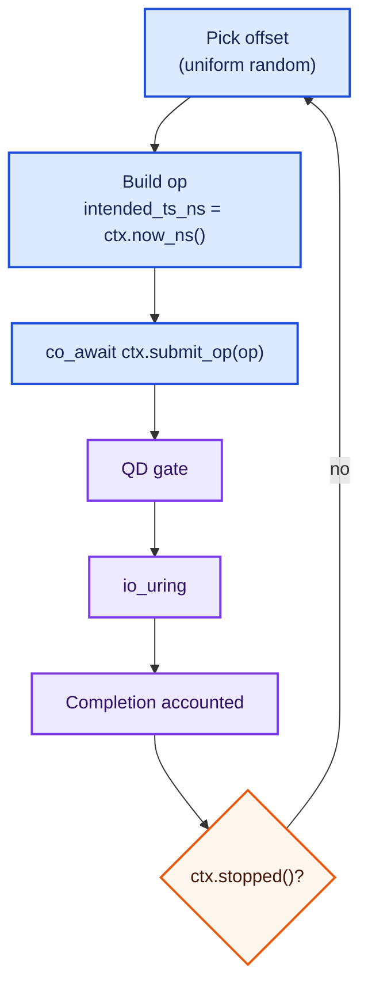
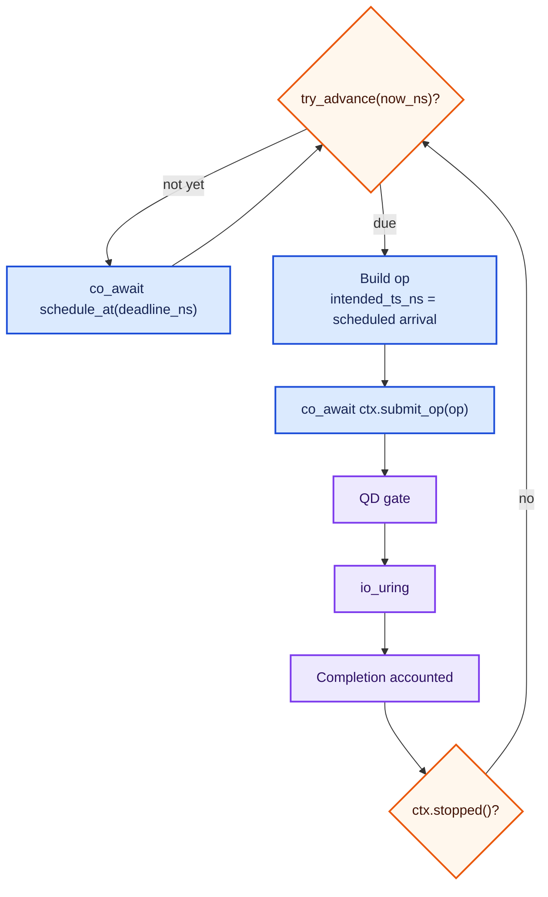
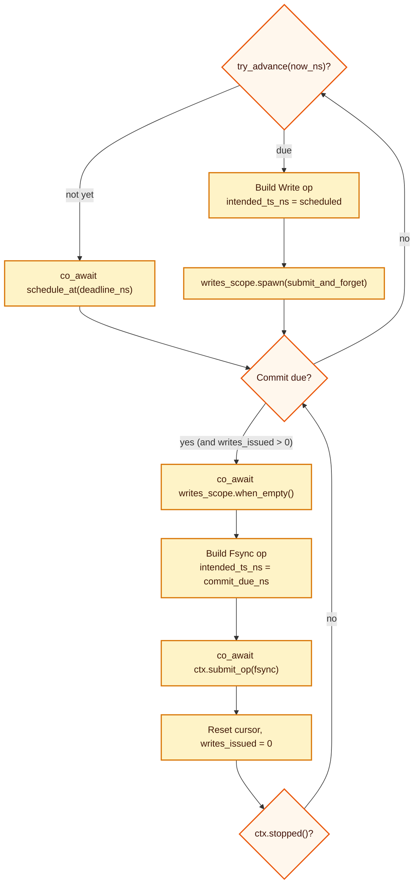

# Adding a new profile

This guide walks through every file you touch to add a new billet workload
profile, using a MongoDB block-layer approximation as the running worked
example. By the end you will have:

- a config struct and public header
- a templated implementation header (testable without the engine)
- a compilation unit that registers the component table
- CMake and CLI wiring
- a profile doc following the conventions of this directory

## What a profile is

A profile is an `exec::task<void>` coroutine that receives a
`workload_ctx&`. It decides when to issue ops, then does one of:

```text
co_await ctx.submit_op(op)          // single op, awaits completion
writes_scope.spawn(submit_op(op))   // fire-and-forget into a scope
co_await ctx.scheduler().schedule_at(ns) // sleep until a time
```

The engine drives the coroutine on one `io_uring` worker. Timers, I/O
completions, and QD backpressure all run through the same CQE polling loop.

```mermaid
flowchart LR
    classDef setup   fill:#e8f3ff,stroke:#2563eb,stroke-width:2px,color:#0f172a
    classDef emit    fill:#dbeafe,stroke:#1d4ed8,stroke-width:2px,color:#172554
    classDef shared  fill:#ede9fe,stroke:#7c3aed,stroke-width:2px,color:#2e1065
    classDef output  fill:#fee2e2,stroke:#dc2626,stroke-width:2px,color:#450a0a

    cfg["profile config<br/>from CLI flags"]:::setup
    profile["profile run<br/>exec::task&lt;void&gt;"]:::setup
    emitters["emitters<br/>Poisson streams / timers / bursts"]:::emit
    op["op<br/>kind, component_id, offset, len,<br/>intended_ts_ns"]:::emit
    ctx["workload_ctx<br/>schedule_at + submit_op + QD gate"]:::shared
    engine["sender engine<br/>io_uring + HDR accounting"]:::shared
    json["billet.run/1<br/>by_op + by_component"]:::output

    cfg --> profile --> emitters --> op --> ctx --> engine --> json
    engine -. "completion + accounting" .-> ctx
```



## File layout for a new profile

```
include/billet/workload/
    mongodb.hpp                 ← public API: config + components() + run()
src/workload/
    mongodb_impl.hpp            ← templated impl (private; testable)
    mongodb.cpp                 ← component table + engine instantiation
    CMakeLists.txt              ← add mongodb.cpp
src/cli/
    main.cpp                    ← wire up CLI options + builder (5 spots)
docs/profiles/
    mongodb.md                  ← profile doc following this directory's style
```

## Step 1 — Design your component table

Before writing any code, decide what `(component, op_kind)` cells you
need. Each cell becomes a row in the JSON's `by_component` map and a
column in the comparison heat-grid.

**Rules:**
- Each `component_id` is a unique `uint16_t` index into your component
  table. Name them in a `<profile>_component` namespace constant block.
- A component may declare multiple `op_kind`s (e.g. WAL emits both Write
  and Fsync). The engine tracks them as separate cells with a dotted key
  `<component>.<Op>`.
- Available kinds: `read`, `write`, `fsync`, `discard`, `write_zeroes`
  (the last two are not yet wired through `io_uring`; use `read`, `write`,
  `fsync` for now).

**MongoDB example:**

| Component | Op kinds | JSON cell(s) | What it stresses |
| --- | --- | --- | --- |
| `reader` | `Read` | `reader.Read` | WiredTiger page cache miss → random 4 KiB read |
| `writer` | `Write` | `writer.Write` | dirty page writeback → random 4 KiB write |
| `journal` | `Write`, `Fsync` | `journal.Write`, `journal.Fsync` | sequential journal append + commit drain+flush |

Three components, four cells. The journal pattern mirrors the PostgreSQL WAL
emitter: writes are fire-and-forget into a scope; fsync drains the scope
then flushes, with `intended_ts_ns` set to the commit-boundary time (not
the post-drain wall time) so reported latency includes the drain interval.


## Step 2 — Public header

`include/billet/workload/mongodb.hpp`

This is the only header external consumers (CLI, tests) include.

```cpp
#pragma once

#include <cstdint>
#include <span>

#include <exec/task.hpp>

#include <billet/workload/workload.hpp>

namespace billet::engine { class workload_ctx; }

namespace billet::workload::profiles {

// Stable integer IDs for the MongoDB profile's component table.
// Index into the span returned by mongodb_components().
namespace mdb_component {
constexpr uint16_t reader  = 0;
constexpr uint16_t writer  = 1;
constexpr uint16_t journal = 2;  // emits both Write and Fsync
} // namespace mdb_component

// Single source of truth for which (component, op_kind) cells the stats
// group registers, the JSON uses as keys, and the engine accounts per-cell.
std::span<component_spec const> mongodb_components();

struct mongodb_config {
    uint64_t device_size_bytes{0};

    uint32_t readers{2};
    uint32_t reader_target_iops{1000};  // per-reader, open-loop
    double   hot_set_frac{0.20};        // fraction treated as working set
    double   locality{0.80};            // P(read targets hot set)

    uint32_t writers{1};
    uint32_t writer_target_iops{300};   // per-writer, open-loop

    uint64_t journal_region_offset{0};
    uint64_t journal_region_size{1ull << 29};    // 512 MiB cyclic region
    uint64_t journal_bytes_per_sec{20ull << 20}; // 20 MiB/s append rate
    uint32_t journal_commit_ms{100};             // WiredTiger default

    uint32_t block_size{4096};   // 4 KiB pages throughout
    uint64_t rng_seed{0};        // 0 → seed from std::random_device
};

exec::task<void> mongodb_run(billet::engine::workload_ctx& ctx,
                             mongodb_config const& cfg,
                             uint32_t qd);

} // namespace billet::workload::profiles
```

## Step 3 — Templated implementation

`src/workload/mongodb_impl.hpp`

Template the run function on `Ctx` so tests can substitute a
`manual_scheduler`-backed context without touching the engine. The
production `.cpp` instantiates against `engine::workload_ctx`.

```cpp
#pragma once

// Private to billet's profile implementations. Do NOT include externally.

#include <algorithm>
#include <random>

#include <exec/async_scope.hpp>
#include <stdexec/execution.hpp>

#include <billet/workload/mongodb.hpp>
#include <workload/scheduling.hpp>   // poisson_emitter, make_rng

namespace billet::workload::profiles::detail {

// ── Reader emitter ──────────────────────────────────────────────────────────
// Hot-set biased random 4 KiB reads, open-loop Poisson, one in-flight
// per coroutine. Fan out N of these to multiply read pressure.
template <typename Ctx>
exec::task<void> mdb_reader_emitter(Ctx& ctx, uint64_t device_size_bytes,
                                    uint32_t block_size, uint32_t target_iops,
                                    double hot_set_frac, double locality,
                                    uint64_t seed) {
    uint64_t const total_blocks = device_size_bytes / block_size;
    if (0 == total_blocks) { co_return; }

    poisson_emitter              emitter(target_iops, seed);
    std::mt19937_64              rng(make_rng(seed ^ 0xa1a1a1a1ULL));
    std::bernoulli_distribution  bernoulli(locality);
    uint64_t const hot_blocks =
        std::min(total_blocks,
                 std::max<uint64_t>(1, static_cast<uint64_t>(
                     static_cast<double>(total_blocks) * hot_set_frac)));
    bool const have_cold = (hot_blocks < total_blocks);
    std::uniform_int_distribution<uint64_t> hot_dist(0, hot_blocks - 1);
    std::uniform_int_distribution<uint64_t> cold_dist(
        hot_blocks, have_cold ? total_blocks - 1 : hot_blocks);

    while (!ctx.stopped()) {
        uint64_t scheduled = 0;
        if (!emitter.try_advance(ctx.now_ns(), scheduled)) {
            co_await ctx.scheduler().schedule_at(emitter.deadline_ns());
            continue;
        }
        uint64_t const block_idx =
            (have_cold && !bernoulli(rng)) ? cold_dist(rng) : hot_dist(rng);
        op o{};
        o.kind           = op_kind::read;
        o.component_id   = mdb_component::reader;
        o.offset         = block_idx * block_size;
        o.len            = block_size;
        o.intended_ts_ns = scheduled;
        (void)co_await ctx.submit_op(o);
    }
}

// ── Writer emitter ──────────────────────────────────────────────────────────
// Uniform random 4 KiB writes across the device, open-loop Poisson.
template <typename Ctx>
exec::task<void> mdb_writer_emitter(Ctx& ctx, uint64_t device_size_bytes,
                                    uint32_t block_size, uint32_t target_iops,
                                    uint64_t seed) {
    uint64_t const total_blocks = device_size_bytes / block_size;
    if (0 == total_blocks) { co_return; }

    poisson_emitter                           emitter(target_iops, seed);
    std::mt19937_64                           rng(make_rng(seed ^ 0xb2b2b2b2ULL));
    std::uniform_int_distribution<uint64_t>   dist(0, total_blocks - 1);

    while (!ctx.stopped()) {
        uint64_t scheduled = 0;
        if (!emitter.try_advance(ctx.now_ns(), scheduled)) {
            co_await ctx.scheduler().schedule_at(emitter.deadline_ns());
            continue;
        }
        op o{};
        o.kind           = op_kind::write;
        o.component_id   = mdb_component::writer;
        o.offset         = dist(rng) * block_size;
        o.len            = block_size;
        o.intended_ts_ns = scheduled;
        (void)co_await ctx.submit_op(o);
    }
}

// Helper: fire a single submit_op into a scope without blocking emission.
template <typename Ctx>
exec::task<void> submit_and_forget(Ctx& ctx, op o) {
    (void)co_await ctx.submit_op(o);
}

// ── Journal emitter ─────────────────────────────────────────────────────────
// Append-only sequential writes into a cyclic region, plus a periodic
// commit boundary: drain outstanding writes, then submit one Fsync.
//
// intended_ts_ns for the Fsync is set to the commit-due time (before the
// drain), so journal.Fsync latency = drain cost + device flush latency.
// This is the same discipline as the PostgreSQL WAL emitter.
template <typename Ctx>
exec::task<void> mdb_journal_emitter(Ctx& ctx,
                                     uint64_t region_offset,
                                     uint64_t region_size,
                                     uint64_t bytes_per_sec,
                                     uint32_t commit_ms,
                                     uint32_t block_size,
                                     uint64_t seed) {
    uint64_t const effective_region =
        (0 < region_size) ? region_size : block_size;
    poisson_emitter emitter(
        static_cast<double>(bytes_per_sec) /
        static_cast<double>(std::max<uint32_t>(1, block_size)), seed);

    uint64_t cursor         = 0;
    uint64_t last_commit_ns = ctx.now_ns();
    uint64_t writes_issued  = 0;

    exec::async_scope writes_scope;

    while (!ctx.stopped()) {
        while (true) {
            bool const commit_due =
                (0 < commit_ms) &&
                (ctx.now_ns() >=
                 last_commit_ns + uint64_t(commit_ms) * 1'000'000ULL);

            if (commit_due && 0 < writes_issued) {
                uint64_t const commit_due_ns =
                    last_commit_ns + uint64_t(commit_ms) * 1'000'000ULL;

                co_await writes_scope.when_empty(stdexec::just());

                op fs{};
                fs.kind           = op_kind::fsync;
                fs.component_id   = mdb_component::journal;
                fs.intended_ts_ns = commit_due_ns;
                auto compl_    = co_await ctx.submit_op(fs);
                last_commit_ns = fs.intended_ts_ns +
                                 static_cast<uint64_t>(compl_.latency_ns);
                writes_issued  = 0;
                break;
            }

            if (ctx.stopped()) { break; }

            uint64_t scheduled = 0;
            if (!emitter.try_advance(ctx.now_ns(), scheduled)) {
                co_await ctx.scheduler().schedule_at(
                    emitter.deadline_ns());
                continue;
            }
            op o{};
            o.kind           = op_kind::write;
            o.component_id   = mdb_component::journal;
            o.offset         = region_offset + (cursor % effective_region);
            o.len            = block_size;
            o.intended_ts_ns = scheduled;
            cursor += block_size;
            ++writes_issued;
            writes_scope.spawn(submit_and_forget(ctx, o));
        }
    }

    co_await writes_scope.when_empty(stdexec::just());
}

// ── Profile entry point ─────────────────────────────────────────────────────
template <typename Ctx>
exec::task<void> mongodb_run_impl(Ctx& ctx,
                                  mongodb_config const& cfg,
                                  uint32_t qd) {
    exec::async_scope emitters;

    if (0 < cfg.reader_target_iops) {
        for (uint32_t i = 0; cfg.readers > i; ++i) {
            uint64_t const seed =
                (0 == cfg.rng_seed) ? 0ULL
                    : (cfg.rng_seed ^ (uint64_t{0xa1} << 32) ^ i);
            emitters.spawn(mdb_reader_emitter(
                ctx, cfg.device_size_bytes, cfg.block_size,
                cfg.reader_target_iops, cfg.hot_set_frac,
                cfg.locality, seed));
        }
    }
    if (0 < cfg.writer_target_iops) {
        for (uint32_t i = 0; cfg.writers > i; ++i) {
            uint64_t const seed =
                (0 == cfg.rng_seed) ? 0ULL
                    : (cfg.rng_seed ^ (uint64_t{0xb2} << 32) ^ i);
            emitters.spawn(mdb_writer_emitter(
                ctx, cfg.device_size_bytes, cfg.block_size,
                cfg.writer_target_iops, seed));
        }
    }
    if (0 < cfg.journal_bytes_per_sec) {
        emitters.spawn(mdb_journal_emitter(
            ctx, cfg.journal_region_offset, cfg.journal_region_size,
            cfg.journal_bytes_per_sec, cfg.journal_commit_ms,
            cfg.block_size, cfg.rng_seed));
    }

    co_await emitters.when_empty(stdexec::just());
}

} // namespace billet::workload::profiles::detail
```

## Step 4 — Compilation unit

`src/workload/mongodb.cpp`

This is the only `.cpp` for the profile. It owns the component table and
instantiates the templated impl against the engine's concrete `workload_ctx`.

```cpp
#include <billet/workload/mongodb.hpp>

#include <engine/sender_workload_ctx.hpp>
#include <workload/mongodb_impl.hpp>

namespace billet::workload::profiles {

namespace {
constexpr op_kind k_reader_kinds[]  = {op_kind::read};
constexpr op_kind k_writer_kinds[]  = {op_kind::write};
constexpr op_kind k_journal_kinds[] = {op_kind::write, op_kind::fsync};

constexpr component_spec k_mdb_components[] = {
    {"reader",  "reader",  k_reader_kinds},
    {"writer",  "writer",  k_writer_kinds},
    {"journal", "journal", k_journal_kinds},
};
} // namespace

std::span<component_spec const> mongodb_components() {
    return std::span<component_spec const>{k_mdb_components};
}

exec::task<void> mongodb_run(billet::engine::workload_ctx& ctx,
                             mongodb_config const& cfg,
                             uint32_t qd) {
    co_await detail::mongodb_run_impl(ctx, cfg, qd);
}

} // namespace billet::workload::profiles
```

### Component table rules

- The order of entries in `k_mdb_components[]` is the `component_id` order.
  `mdb_component::reader = 0` must match `k_mdb_components[0]`, and so on.
- `json_name` is the prefix in `by_component` keys (`"journal"` → `"journal.Write"`,
  `"journal.Fsync"`). Stable across releases.
- `metric_name` is the `cell` label value in Prometheus. Usually equals
  `json_name`; decouple if you need underscore-safe metric names while
  keeping display-friendly JSON keys.
- Multi-kind components (`journal`) declare kinds in the order they appear
  conceptually (Write before Fsync). `make_cell_layout` assigns cell indices
  in component-outer, kind-inner order, which is also the order JSON output
  iterates when serializing `by_component`.

## Step 5 — CMake

Add the new source to `src/workload/CMakeLists.txt`:

```cmake
add_library(workload STATIC
    mongodb.cpp        # ← add
    postgresql.cpp
    random_read_4k.cpp
)
```

No other CMake changes are needed. The `workload` target already links
everything a profile needs (`stdexec`, `stats`, `sisl`, `liburing`,
`hdr_histogram`).

## Step 6 — CLI wiring

Five spots in `src/cli/main.cpp`:

### 6a. Option definitions

Append to the `SISL_OPTION_GROUP(billet, ...)` macro block. Use a consistent
prefix (`mdb-`) to keep profile options visually grouped:

```cpp
(mdb_readers,       "", "mdb-readers",        "(mongodb) Number of reader emitters",
 ::cxxopts::value<uint32_t>()->default_value("2"), ""),
(mdb_reader_iops,   "", "mdb-reader-iops",    "(mongodb) Per-reader open-loop target IOPS",
 ::cxxopts::value<uint32_t>()->default_value("1000"), ""),
(mdb_writers,       "", "mdb-writers",        "(mongodb) Number of writer emitters",
 ::cxxopts::value<uint32_t>()->default_value("1"), ""),
(mdb_writer_iops,   "", "mdb-writer-iops",    "(mongodb) Per-writer open-loop target IOPS",
 ::cxxopts::value<uint32_t>()->default_value("300"), ""),
(mdb_journal_mb_per_sec, "", "mdb-journal-mb-per-sec",
 "(mongodb) Journal write throughput target (MiB/s)",
 ::cxxopts::value<uint32_t>()->default_value("20"), ""),
(mdb_journal_commit_ms,  "", "mdb-journal-commit-ms",
 "(mongodb) Journal commit interval (ms)",
 ::cxxopts::value<uint32_t>()->default_value("100"), ""),
(mdb_hot_set_frac,  "", "mdb-hot-set-frac",   "(mongodb) Fraction of device as working set",
 ::cxxopts::value<double>()->default_value("0.20"), ""),
(mdb_locality,      "", "mdb-locality",        "(mongodb) P(read targets hot set)",
 ::cxxopts::value<double>()->default_value("0.80"), ""),
```

### 6b. Profile descriptor table

In `lookup_profile()`:

```cpp
static constexpr profile_descriptor table[] = {
    {"random_read_4k", false, 4096},
    {"postgresql",     true,  65536},
    {"mongodb",        true,  4096},  // ← add; destructive = true (journal writes)
};
```

`pool_block_size` is the size of buffers the engine pre-allocates for this
profile's largest op. Match it to the maximum `op.len` your profile emits.

### 6c. Component spec dispatch

In `profile_components()`:

```cpp
if ("mongodb" == name) {
    return billet::workload::profiles::mongodb_components();
}
```

### 6d. Profile builder

In the `builder` construction block, extend the if/else chain:

```cpp
} else if ("mongodb" == profile_name) {
    billet::workload::profiles::mongodb_config mdb{};
    mdb.device_size_bytes      = dev->size_bytes;
    mdb.readers                = SISL_OPTIONS["mdb-readers"].as<uint32_t>();
    mdb.reader_target_iops     = SISL_OPTIONS["mdb-reader-iops"].as<uint32_t>();
    mdb.writers                = SISL_OPTIONS["mdb-writers"].as<uint32_t>();
    mdb.writer_target_iops     = SISL_OPTIONS["mdb-writer-iops"].as<uint32_t>();
    mdb.journal_bytes_per_sec  =
        uint64_t(SISL_OPTIONS["mdb-journal-mb-per-sec"].as<uint32_t>()) << 20;
    mdb.journal_commit_ms      = SISL_OPTIONS["mdb-journal-commit-ms"].as<uint32_t>();
    mdb.hot_set_frac           = SISL_OPTIONS["mdb-hot-set-frac"].as<double>();
    mdb.locality               = SISL_OPTIONS["mdb-locality"].as<double>();
    builder = [mdb, cfg_qd = cfg.qd](billet::engine::workload_ctx& ctx)
              -> exec::task<void> {
        co_await billet::workload::profiles::mongodb_run(ctx, mdb, cfg_qd);
    };
```

### 6e. JSON params

In the `rec.profile.params` block, extend the if/else chain to capture
every parameter that shapes the workload so JSON files are self-describing:

```cpp
} else if ("mongodb" == profile_name) {
    rec.profile.params["readers"]              =
        std::to_string(SISL_OPTIONS["mdb-readers"].as<uint32_t>());
    rec.profile.params["reader_target_iops"]   =
        std::to_string(SISL_OPTIONS["mdb-reader-iops"].as<uint32_t>());
    rec.profile.params["writers"]              =
        std::to_string(SISL_OPTIONS["mdb-writers"].as<uint32_t>());
    rec.profile.params["writer_target_iops"]   =
        std::to_string(SISL_OPTIONS["mdb-writer-iops"].as<uint32_t>());
    rec.profile.params["journal_mb_per_sec"]   =
        std::to_string(SISL_OPTIONS["mdb-journal-mb-per-sec"].as<uint32_t>());
    rec.profile.params["journal_commit_ms"]    =
        std::to_string(SISL_OPTIONS["mdb-journal-commit-ms"].as<uint32_t>());
    rec.profile.params["workers"]              =
        std::to_string(worker_count);
    {
        char buf[32];
        std::snprintf(buf, sizeof(buf), "%.4f",
                      SISL_OPTIONS["mdb-hot-set-frac"].as<double>());
        rec.profile.params["hot_set_frac"] = buf;
        std::snprintf(buf, sizeof(buf), "%.4f",
                      SISL_OPTIONS["mdb-locality"].as<double>());
        rec.profile.params["locality"] = buf;
    }
```

Also add the include at the top of `main.cpp`:

```cpp
#include <billet/workload/mongodb.hpp>
```

## Emitter patterns

Three patterns cover every profile built so far. New profiles should
compose from these.

### Closed-loop lane

Each coroutine issues one op and awaits completion before issuing the
next. Natural concurrency = number of spawned lanes. Used by
`random_read_4k` for its pure-saturation model.



`intended_ts_ns = ctx.now_ns()` at issue time means latency is pure
service time — there is no coordinated-omission correction needed.

### Open-loop Poisson stream

Each coroutine targets a rate by spacing arrivals with an exponential
inter-arrival. `intended_ts_ns` is the *scheduled* arrival, so latency
includes any queueing delay behind earlier work. Used by `postgresql`
readers, random writers, and WAL appends, and by `mongodb` readers and
writers.



Key: `intended_ts_ns` comes from `poisson_emitter::try_advance`, not
from `ctx.now_ns()` at submission time. If earlier work delayed
submission, the latency histogram captures that delay.

### Fire-and-forget with periodic drain+fsync

Used for stream emitters that need a periodic commit boundary (WAL,
journal). Writes are spawned into a local `async_scope` without awaiting
each one. When the commit interval fires, the scope drains all prior
writes before submitting a single Fsync. The Fsync's `intended_ts_ns` is
the moment the boundary became due, not the post-drain wall time.



The latency reported for the Fsync cell is:

```text
completion_ts_ns − commit_due_ns
```

This includes the drain interval (time waiting for spawned writes to
complete) plus the device flush. That is the "commit boundary cost" most
storage performance work cares about.

## Step 7 — Profile documentation

Add `docs/profiles/mongodb.md` following the same structure as
`postgresql.md`. Required sections:

1. **One-line description** — "what real I/O pattern does this approximate
   and what does it *not* model."
2. **Components table** — the `(component, op_kind, json_key, what_it_stresses)`
   table. Copy the format from `postgresql.md`.
3. **Workflow state diagram** — full Mermaid `flowchart TD` covering config →
   run → scope → each emitter subgraph → shared ctx/engine → output.
4. **Database-I/O mapping** — which real application path each emitter
   approximates, and what it does not capture.
5. **CLI knobs** — table of `--mdb-*` options, defaults, and effect.
   Include an example invocation.
6. **Latency semantics** — whether each cell is open-loop (latency includes
   queueing) or closed-loop (latency is service time only).
7. **Limitations** — explicit list of what the profile does not model (lock
   waits, eviction, replication, oplog, etc.).
8. **What it does not model** — one paragraph coda.

Also add a link to the new doc in `docs/profiles/README.md` under Profiles
and under Workflow diagrams.

## Completion checklist

```
[ ] include/billet/workload/mongodb.hpp        — config, component IDs, run() decl
[ ] src/workload/mongodb_impl.hpp              — templated impl + all emitters
[ ] src/workload/mongodb.cpp                  — component table + instantiation
[ ] src/workload/CMakeLists.txt               — mongodb.cpp added
[ ] src/cli/main.cpp:
      [ ] #include <billet/workload/mongodb.hpp>
      [ ] SISL_OPTION_GROUP entries (--mdb-*)
      [ ] lookup_profile() table entry
      [ ] profile_components() branch
      [ ] builder if/else branch
      [ ] rec.profile.params branch
[ ] docs/profiles/mongodb.md                  — full profile doc with diagrams
[ ] docs/profiles/README.md                   — link added
[ ] test/test_profiles.cpp                    — mongodb_components() cell assertions
```

### Test: component table assertions

Add to `test/test_profiles.cpp` (see `postgresql_components` test as model):

```cpp
#include <billet/workload/mongodb.hpp>

namespace mdb_component = billet::workload::profiles::mdb_component;

TEST(mongodb_components, declares_expected_cells) {
    auto const specs = billet::workload::profiles::mongodb_components();
    ASSERT_EQ(3u, specs.size());

    EXPECT_EQ("reader",  specs[mdb_component::reader].json_name);
    EXPECT_EQ("writer",  specs[mdb_component::writer].json_name);
    EXPECT_EQ("journal", specs[mdb_component::journal].json_name);

    ASSERT_EQ(1u, specs[mdb_component::reader].kinds.size());
    EXPECT_EQ(op_kind::read, specs[mdb_component::reader].kinds[0]);

    ASSERT_EQ(1u, specs[mdb_component::writer].kinds.size());
    EXPECT_EQ(op_kind::write, specs[mdb_component::writer].kinds[0]);

    ASSERT_EQ(2u, specs[mdb_component::journal].kinds.size());
    EXPECT_EQ(op_kind::write, specs[mdb_component::journal].kinds[0]);
    EXPECT_EQ(op_kind::fsync, specs[mdb_component::journal].kinds[1]);
}
```

This is a pure unit test — no device, no engine, no timing. It verifies
that `component_id` constants, spec ordering, and kind declarations are
consistent before you ever run the profile against real hardware.
