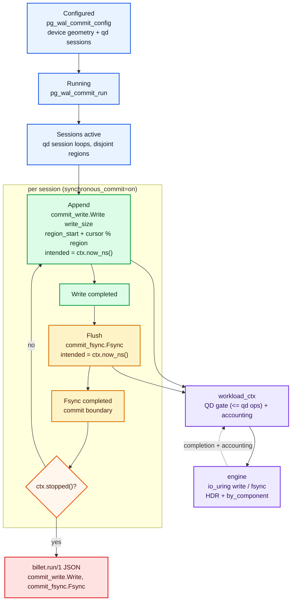

# pg_wal_commit

`pg_wal_commit` models the synchronous-commit fsync storm: hundreds of
PostgreSQL sessions each running `synchronous_commit = on`, where every commit
writes a WAL record and then blocks on a flush before returning to the
application. Each session is a tight closed loop of `Write(write_size)` followed
by an `Fsync`, with no reads, no checkpointer, and no group-commit batching.

It answers one narrow question: when many sessions each block on a per-commit
flush, what commit-path write and fsync latencies does this device deliver?

Set `--qd` to the session count. This is the opposite extreme from the
[postgresql](postgresql.md) profile's WAL emitter, which is open-loop append
with a *periodic* drain-and-flush cycle; neither models group commit (see
[Limitations](#limitations) and the buffered-commit item in the roadmap).

The profile is destructive. It writes to the target device.

## Components

The profile accounts two component/op cells:

| Component | Op kind | JSON key | Meaning |
| --- | --- | --- | --- |
| `commit_write` | `Write` | `commit_write.Write` | per-commit WAL record append (`--pgwc-write-size`, default 8 KiB) |
| `commit_fsync` | `Fsync` | `commit_fsync.Fsync` | the flush each session blocks on after its write |

Keeping write and fsync in separate cells is the point: `commit_fsync.Fsync` is
the latency a committing backend actually waits on, and it is the number this
profile exists to expose.

## Profile Shape

The CLI builds the profile with:

```text
pg_wal_commit_run(ctx, cfg, sessions = qd)
```

`pg_wal_commit_run` partitions the device into `sessions` equal slices and
spawns one session loop per slice into an `exec::async_scope`. Each session owns
a disjoint region so sessions do not contend on identical LBAs (which would be a
device-internal artifact, not commit latency). Submission is still serialized
through the single worker's `io_uring`, so the device sees one ordered stream of
commits, the way one physical WAL device would.

Each session loop is closed-loop:

1. `Write` `write_size` bytes at the session's cursor, advancing sequentially
   and wrapping within the session region.
2. Await the write completion.
3. `Fsync`.
4. Await the fsync completion. This is the commit boundary.
5. Repeat until `ctx.stopped()`.

Because the write is awaited before the fsync issues, `commit_fsync.Fsync`
measures the flush of already-written data, not write plus flush. With
`sessions` loops each holding at most one op in flight, peak inflight is
`sessions`, which is exactly `--qd`, so the `workload_ctx` QD gate and the
session count agree.

## Flow Diagram



## Operation Generation

For `sessions` sessions over a device of `device_size_bytes`:

- `partition = floor(device_size_bytes / sessions)` aligned down to
  `write_size` (so every offset is write-size aligned for O_DIRECT)
- `region = min(--pgwc-region-mb, partition)`; if `region < write_size` the
  profile is a no-op (too many sessions for the device)
- session `i` owns `[partition * i, partition * i + region)`
- per iteration: `offset = partition*i + (cursor % region)`, `len = write_size`,
  `cursor += write_size`
- the `Fsync` carries no offset or length; it flushes the open fd

Sessions write sequentially inside their region and wrap at the region
boundary, mirroring a WAL segment being recycled.

## Accounting and Latency Semantics

Closed-loop, so `intended_ts_ns == issue_ts_ns` and there is no
coordinated-omission correction to apply:

```text
latency_ns = completion_ts_ns - issue_ts_ns
```

- `commit_write.Write` is the WAL append service time under the aggregate
  commit load.
- `commit_fsync.Fsync` is the per-commit flush latency, the figure a Postgres
  engineer means by "commit latency" at the storage layer. Because every commit
  flushes, fsync volume equals write volume; a device that coalesces or caches
  flushes will show it here.

## CLI Knobs

| Option | Default | Effect |
| --- | ---: | --- |
| `--qd` | `32` | number of synchronous-commit sessions |
| `--pgwc-write-size` | `8192` | bytes written per commit |
| `--pgwc-region-mb` | `64` | per-session cycling region in MiB |

```bash
build/Release/src/cli/billet \
  --device /dev/nvme0n1 \
  --profile pg_wal_commit \
  --qd 256 --duration 60 \
  --pgwc-write-size 8192 --pgwc-region-mb 64 \
  --allow-destructive \
  --output pgwc.json
```

A high `--qd` (for example `256`) is the point of this profile: it models
hundreds of backends all blocked on commit flushes at once.

`pg_wal_commit` always runs single-worker. A real instance commits through one
physical WAL device, so fanning the commit stream across cores would model the
wrong thing; `--workers > 1` logs a warning and runs one worker. `--pin-strategy`
still applies and places that worker (default `auto`, which pins it to a
NUMA-local hardware queue). Add `--metrics-port <N>` to expose Prometheus
`/metrics`; the docker-compose stack in [example/grafana/](../../example/grafana/)
brings up a live dashboard.

## Limitations

This is a commit-path block-pressure model, not a commit-pipeline simulator.

- **No group commit.** Every session flushes its own record. Real PostgreSQL
  batches concurrently-arrived commits behind one `fdatasync`, so this profile
  issues strictly more flushes than a group-committing instance would and is a
  pessimistic (worst-case fsync-rate) canary.
- **No LSN, no commit waiters.** There is no shared log position and no
  ordering between sessions beyond the device queue; latency is per-op, not
  per-transaction-group.
- **No reads, no checkpointer, no background writer.** For mixed foreground
  read/write plus WAL plus checkpoint interference, use the
  [postgresql](postgresql.md) profile.
- **Sessions write disjoint regions, not one shared WAL file.** The single
  serialized submission stream is the part that mirrors one WAL device; the LBA
  layout is spread on purpose to keep device-internal write contention out of
  the commit-latency measurement.
