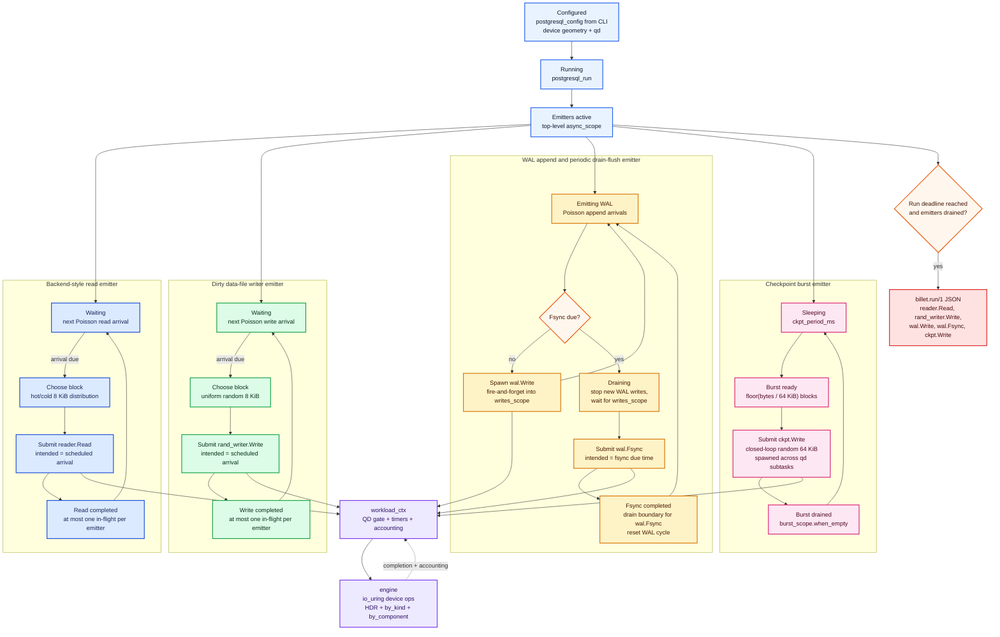

# postgresql

`postgresql` is a block-layer approximation of a busy PostgreSQL deployment.
It is not a database simulator. It does not parse SQL, model locks, or know
about tables. It generates the I/O *shapes* PostgreSQL tends to produce when
the database is under mixed read/write load:

- hot-set-biased random reads
- random data-file writes
- sequential WAL appends
- periodic WAL drain + fsync cycle (drain in-flight writes, then flush)
- checkpoint write bursts

This is PostgreSQL-shaped block pressure, **not** a faithful commit-pipeline
simulator. The WAL emitter has no LSN, no commit waiters, and no
group-commit batching -- see [Limitations vs real Postgres
WAL](#limitations-vs-real-postgres-wal) below. Good for stress-canary work
(layered-storage comparison, queueing-fairness diagnosis); not the right
tool for an absolute "commit latency" number a Postgres engineer would
quote.

The profile is destructive. It writes to the target device.

## Components

The profile accounts five component/op cells:

| Component | Op kind | JSON key | Meaning |
| --- | --- | --- | --- |
| `reader` | `Read` | `reader.Read` | 8 KiB reads from a hot/cold block distribution |
| `rand_writer` | `Write` | `rand_writer.Write` | 8 KiB random data-file writes |
| `wal` | `Write` | `wal.Write` | sequential 8 KiB WAL appends |
| `wal` | `Fsync` | `wal.Fsync` | WAL drain plus device flush |
| `ckpt` | `Write` | `ckpt.Write` | 64 KiB checkpoint burst writes |

The dotted JSON keys are deliberate. Splitting by only op kind would mix WAL,
random-writer, and checkpoint writes. Splitting by only component would mix WAL
writes and fsyncs. PostgreSQL performance work usually needs the cross product.

## Workflow State Diagram



## Database-I/O Mapping

| Database path | Profile emitter | JSON cell | What it stresses |
| --- | --- | --- | --- |
| Backend buffer miss / relation read | reader | `reader.Read` | hot/cold random read service time under mixed pressure |
| Dirty data-page writeback | rand_writer | `rand_writer.Write` | steady random data-file write interference |
| WAL insertion/write path | wal | `wal.Write` | sequential append throughput and queueing |
| WAL drain + flush cycle (not group-commit) | wal | `wal.Fsync` | prior WAL write drain plus device flush latency |
| Checkpoint | ckpt | `ckpt.Write` | bursty large random writes competing with foreground I/O |

This is intentionally a generic database I/O emission model. It preserves the
block shapes and timing relationships that matter to the device; it does not
model PostgreSQL executor behavior, buffer manager policy, relation layout, or
lock waits.

## CLI Knobs

The profile is built from `postgresql_config`, populated from these CLI
options:

| Option | Default | Effect |
| --- | ---: | --- |
| `--pg-readers` | `4` | number of reader emitters |
| `--pg-reader-iops` | `2000` | target IOPS for each reader emitter |
| `--pg-writers` | `2` | number of random-writer emitters |
| `--pg-writer-iops` | `500` | target IOPS for each random-writer emitter |
| `--pg-wal-mb-per-sec` | `50` | WAL append target throughput |
| `--pg-wal-fsync-ms` | `200` | time-based WAL fsync interval, `0` disables |
| `--pg-ckpt-period-ms` | `5000` | delay between checkpoint bursts |
| `--pg-ckpt-burst-mb` | `256` | bytes written per checkpoint burst |
| `--pg-hot-set-frac` | `0.10` | fraction of device treated as the read hot set |
| `--pg-locality` | `0.85` | probability that a read targets the hot set |

CLI shape:

```bash
build/Release/src/cli/billet \
  --device /dev/nvme1n1 \
  --profile postgresql \
  --workers 1 --qd 32 --duration 60 \
  --allow-destructive \
  --output pg.json
```

Currently single-worker, so `--workers` must be `1`. Add `--metrics-port
<N>` to expose Prometheus `/metrics`; the docker-compose stack in
[example/grafana/](../../example/grafana/) brings up a live dashboard.

## Profile Shape

The CLI builds the profile with:

```text
postgresql_run(ctx, cfg, qd)
```

The profile creates one top-level `exec::async_scope` and spawns enabled
emitters into it:

- `cfg.readers` reader emitters when `reader_target_iops > 0`
- `cfg.writers` random-writer emitters when `writer_target_iops > 0`
- one WAL emitter when `wal_bytes_per_sec > 0`
- one checkpointer emitter when both checkpoint period and burst size are non-zero

The task returns after `ctx.stopped()` becomes true and the spawned emitter
tasks have drained.

All emitters share the same `workload_ctx` queue-depth gate. WAL and checkpoint
can spawn many coroutine submissions, but only `--qd` device ops are admitted
to the ring at once.

## Reader Emitters

Each reader emitter is an open-loop Poisson stream at
`cfg.reader_target_iops`.

When the next scheduled arrival is in the future, the sender awaits:

```text
ctx.scheduler().schedule_at(emitter.deadline_ns())
```

When an arrival is due, it picks an 8 KiB block:

1. `total_blocks = device_size_bytes / 8192`
2. `hot_blocks = clamp(total_blocks * hot_set_frac, 1, total_blocks)`
3. With probability `locality`, choose from `[0, hot_blocks - 1]`.
4. Otherwise choose from `[hot_blocks, total_blocks - 1]` when that cold range
   exists. If the hot set covers the whole device, every read uses the hot
   distribution.

The emitted op is:

```text
kind           = Read
component_id   = reader
offset         = block_idx * 8192
len            = 8192
intended_ts_ns = scheduled_arrival_ns
```

The coroutine awaits the read completion before issuing its next read, so each
reader emitter has at most one read in flight. Total read pressure comes from
the number of reader emitters and the target rate per emitter.

## Random-Writer Emitters

Each random-writer emitter is another open-loop Poisson stream, at
`cfg.writer_target_iops`.

It chooses uniformly over 8 KiB blocks across the full device and emits:

```text
kind           = Write
component_id   = rand_writer
offset         = block_idx * 8192
len            = 8192
intended_ts_ns = scheduled_arrival_ns
```

Like readers, each writer emitter awaits its write completion before issuing
the next write. Multiple writer emitters are how the profile builds write
pressure.

## WAL Emitter

The WAL emitter approximates WAL append pressure and a periodic
drain-and-flush cycle. It is **not** a Postgres group-commit simulator --
it has no LSN, no commit waiters, and no per-fsync batching of arrived
transactions. The `wal.Fsync` latency it reports is genuinely
"drain + flush" cost, which is *part* of real commit latency but not all
of it (see [Limitations](#limitations-vs-real-postgres-wal)).

WAL write rate is:

```text
wal_write_ops_per_sec = wal_bytes_per_sec / 8192
```

Each scheduled WAL write is:

```text
kind           = Write
component_id   = wal
offset         = wal_region_offset + (cursor % wal_region_size)
len            = 8192
intended_ts_ns = scheduled_arrival_ns
```

Unlike the reader and random-writer emitters, WAL writes are spawned into a
`writes_scope` and are not awaited one by one. That lets the WAL stream keep
emitting at its scheduled rate.

When fsync becomes due, the WAL emitter stops issuing new writes and waits:

```text
co_await writes_scope.when_empty(...)
```

That drains every prior WAL write before the fsync is submitted. The fsync op
uses the instant when fsync became due, not the later wall time after the drain:

```text
kind           = Fsync
component_id   = wal
intended_ts_ns = fsync_due_ns
```

So reported `wal.Fsync` latency is:

```text
fsync_completion_ts_ns - fsync_due_ns
```

That includes pending WAL write drain time plus the device flush. On backends
where block-device fsync is a no-op, the number is mostly the drain cost, which
is still the queueing cost PostgreSQL users care about.

At run stop, the WAL emitter drains outstanding WAL writes before returning. It
does not force an extra final fsync just because the run ended.

## Checkpointer Emitter

The checkpointer sleeps for `ckpt_period_ms`, then writes a burst of 64 KiB
random writes.

The burst is converted to a whole-block count:

```text
burst_blocks = floor(ckpt_burst_bytes / ckpt_block_size)
```

Any sub-block remainder is ignored. For each burst, the profile distributes
that exact block count across up to `qd` sub-tasks, and each sub-task runs
closed-loop until its slice is written:

```text
kind           = Write
component_id   = ckpt
offset         = random_block_idx * ckpt_block_size
len            = ckpt_block_size
intended_ts_ns = ctx.now_ns()
```

After all burst sub-tasks drain, the checkpointer waits another full period
from that point. The period is therefore between bursts as generated by the
sender, not a global wall-clock alignment.

## Latency Semantics

Reader, random-writer, and WAL-write ops are open-loop. Their
`intended_ts_ns` comes from the Poisson scheduler, so latency includes any time
the op was delayed behind earlier work.

Checkpoint writes are closed-loop within a burst. Their `intended_ts_ns` is the
issue timestamp.

WAL fsync is special: its intended timestamp is the moment fsync became due,
before the WAL write drain. That is what makes `wal.Fsync` represent
"drain plus flush" rather than just flush service time.

Real Postgres commit latency would also include the wait from when a
transaction asked to commit until the next fsync boundary scheduled it.
This profile's open-loop model already captures the latter
(`wal.Write` latency includes any wait behind earlier work via
`intended_ts_ns`); the former -- "how long did transaction T wait for a
commit boundary" -- needs the buffered-commit mode that's roadmapped.

## Limitations vs real Postgres WAL

The current WAL emitter is excellent at stressing the device layer's
fairness behavior under append + periodic flush pressure. It is **not** a
faithful PostgreSQL commit pipeline. Specifically:

- **Open-loop append, no `XLogInsert` backpressure.** Real Postgres
  applies backpressure when WAL buffers fill (`XLogInsertRecord` blocks
  on `WALInsertLock`). This profile keeps pumping at the configured
  byte rate regardless of downstream pressure -- which is the right
  thing for measuring "can this storage absorb append pressure without
  starving reads," but doesn't reflect how a real backend would slow
  down.
- **No group commit.** Each `wal.Fsync` here flushes whatever happens
  to be in flight when the timer or write-count threshold triggers. In
  real Postgres one `XLogFlush` satisfies many waiting commits at once,
  and the commit latency a single transaction experiences depends on
  where it landed in the batch.
- **No LSN, no commit waiters.** There is no transaction abstraction in
  the emitter, so the profile cannot answer "how long did transaction T
  wait between its commit request and the fsync that durably persisted
  its log records." That's the headline number a Postgres engineer
  expects from a "commit latency" benchmark; it lives in the buffered-
  commit mode roadmapped for a future release.

For candidate driver / md / device-layer comparison work, the current model is
the right tool -- it's repeatable, sensitive to queueing bugs, and doesn't hide
the symptom we care about. For "should I use this storage for OLTP commit?"
conversations, the current numbers describe the drain-and-flush component of
commit cost but not the group-commit batching dynamics.

## What It Does Not Model

This profile does not model PostgreSQL lock waits, buffer replacement,
background writer policy, relation size skew, SQL transaction mix, filesystem
metadata, or kernel page cache behavior. It is a raw block workload shaped to
stress the same device behaviors PostgreSQL cares about.
