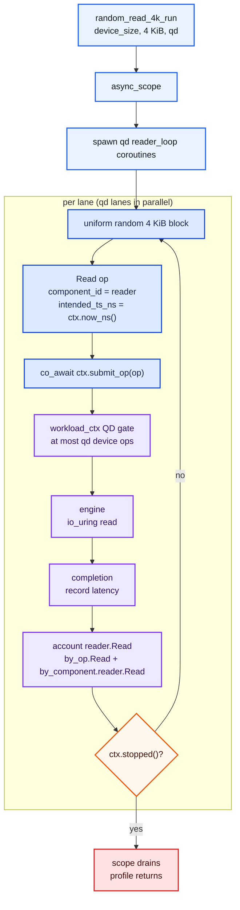

# random_read_4k

`random_read_4k` is the simple read-only baseline: fixed-size 4 KiB random
reads over the whole device, driven as closed-loop sender work at the requested
queue depth.

It answers one narrow question: how does this block device behave under pure
small random reads when the app keeps `qd` reads outstanding?

## Profile Shape

The CLI builds the profile with:

```text
random_read_4k_run(ctx, device_size_bytes, 4096, qd, rng_seed=0)
```

The profile creates an `exec::async_scope` and spawns `qd` reader coroutines.
Each reader coroutine is a single closed-loop lane:

1. Pick a random block.
2. Submit one 4 KiB `Read`.
3. Await its completion.
4. Repeat until `ctx.stopped()` is true.

Because each lane waits for its own completion, the natural in-flight target is
the number of lanes, which is the CLI `--qd` value. The `workload_ctx` queue
gate is still active, so the device-op cap and the lane count agree.

## Flow Diagram



## Operation Generation

For each reader lane:

- `n_blocks = device_size_bytes / 4096`
- `block_idx` is uniform over `[0, n_blocks - 1]`
- `offset = block_idx * 4096`
- `len = 4096`
- `kind = Read`
- `component_id = 0`
- `intended_ts_ns = ctx.now_ns()` at issue time

`rng_seed == 0` means the lane seeds from `std::random_device`. A non-zero seed
is split across lanes so each lane gets a different deterministic stream.

## Accounting

This profile has one component cell:

| Component | Op kind | JSON key |
| --- | --- | --- |
| `reader` | `Read` | `reader.Read` |

Since the workload is closed-loop, latency is:

```text
completion_ts_ns - issue_ts_ns
```

There is no coordinated-omission correction to perform inside HDR. The intended
timestamp already is the issue timestamp.

## CLI Shape

```bash
build/Release/src/cli/billet \
  --device /dev/nvme0n1 \
  --profile random_read_4k \
  --workers 1 --qd 32 --duration 30 \
  --output rr.json
```

`--workers N` runs N pinned workers, each driving its own `qd` closed-loop
readers, so aggregate inflight is `N * qd`; `--workers 0` auto-sizes to one
worker per NUMA-local hardware queue. `--pin-strategy auto|mq|numa|linear|none`
controls placement (see `--probe <dev>` for the discovered queue map). Add
`--metrics-port <N>` to expose Prometheus `/metrics`; the docker-compose stack
in [example/grafana/](../../example/grafana/) brings up a live dashboard.

## What It Does Not Model

This profile intentionally does not model cache locality, write interference,
filesystem behavior, app stalls, or a target IOPS rate. It is a clean random
read pressure test.
