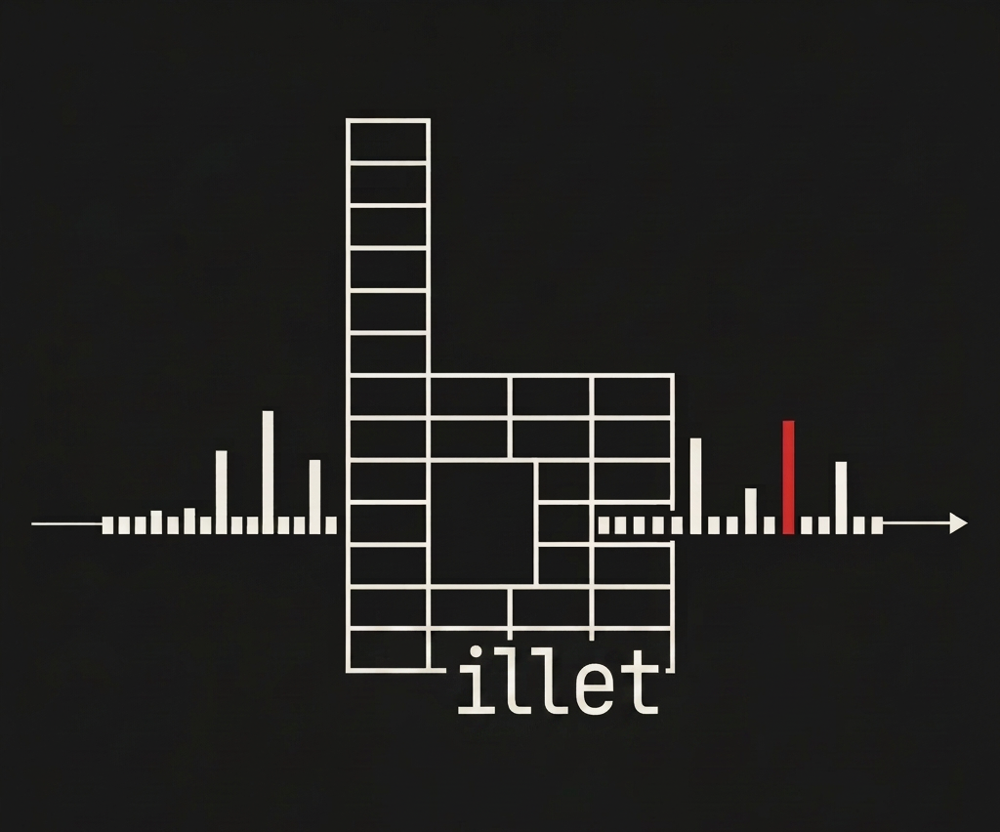
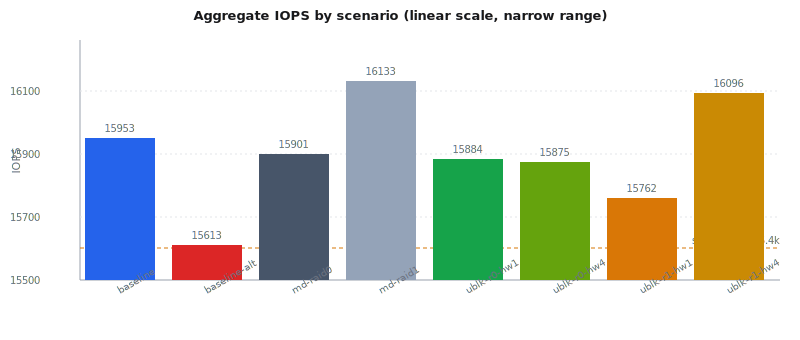
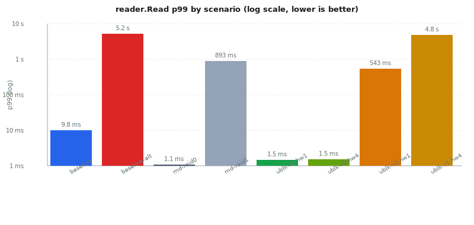
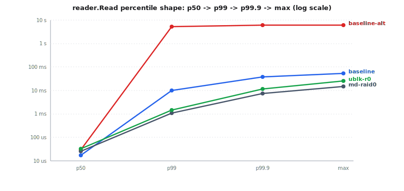
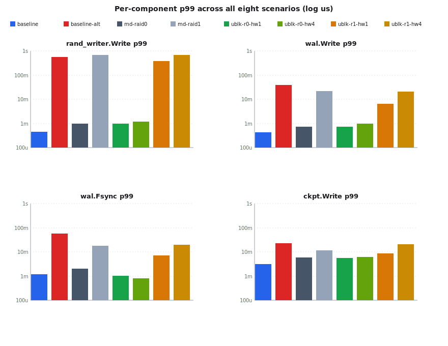

<p align="center">
  
</p>

# billet: ublkpp md vs kernel md vs raw NVMe

A side-by-side under a PostgreSQL-shaped block workload.

> **TL;DR.** All eight runs land within 3% of each other on IOPS and throughput
> (~15.9k IOPS, ~165 MiB/s) because the test is a fixed-rate app shape, not a
> bandwidth race. The story is in the latency tails. Two findings:
>
> 1. The second NVMe (`nvme1n1`, run as `baseline-alt`) has a pathological
>    read tail under mixed load: `reader.Read` p99 of **5.2 seconds** versus
>    9.8 ms on `nvme0n1`. Every RAID1 result inherits this, so the mirror
>    rows in this matrix mostly measure a sick drive, not the driver.
> 2. The clean comparison is RAID0. **ublkpp md-raid0 matches kernel
>    md-raid0** in shape: same IOPS, ~35% higher read p99 (1.5 ms vs 1.1 ms),
>    and a meaningful win on commit cost (`wal.Fsync` p99 ~800 us vs ~2 ms).
>    Both stripes beat the lone-drive baseline on read p99 by 6 to 10x.
>
> **Conclusion:** ublkpp's stripe path is a credible substitute for kernel
> md-raid0 on PostgreSQL-shaped pressure. Mirror evaluation needs cleaner
> hardware before any verdict.

For the same content as a single self-contained file (logo + visuals
embedded, ideal for sending over Slack or email): [REPORT.html](REPORT.html).
For the full interactive comparison (per-cell tail polylines, headline
grid, capability table, scenario p99 / baseline p99 heat-grid):
[pg-compare.html](pg-compare.html).

---

## What is billet

billet is a raw block-device benchmark. It opens the device with `O_DIRECT`,
drives it through native `io_uring`, and emits known **app-shaped** I/O
signals (PostgreSQL-style mixes of hot reads, random writes, sequential WAL
appends, periodic fsync, and checkpoint bursts). It then records exactly
how the device, driver, or storage stack responds.

It is storage instrumentation, not a database simulator. The PostgreSQL
profile does not parse SQL or model locks. It generates the *block events*
PostgreSQL produces under load. That makes it the right tool for asking
"does this candidate driver preserve the shape of the application's I/O?"
before asking a database team to run the real database against it.

Latency is recorded as `completion_ts - intended_ts`, not
`completion_ts - submit_ts`. Open-loop work uses Poisson-scheduled arrival
times; closed-loop work uses issue time. Coordinated omission does not get
a side door.

Each run emits a self-describing JSON (`billet.run/1`) with host metadata,
device geometry, the exact profile parameters, summary aggregates,
per-op-kind stats, per-component stats, and the full HDR histogram payloads
(gzip+base64 encoded) so percentiles can be re-merged later.

## The test

**Profile:** `postgresql`, 120 seconds, queue depth 32, single worker pinned
to CPU 0.

The profile emits five block-event streams that PostgreSQL would generate
under sustained mixed load:

| Component cell | Description | Configured rate |
| --- | --- | --- |
| `reader.Read` | 8 KiB random reads, 85% biased to a 10% hot set | 4 emitters x 2,000 IOPS = 8k/s |
| `rand_writer.Write` | 8 KiB uniform random writes (data-file dirties) | 2 emitters x 500 IOPS = 1k/s |
| `wal.Write` | Sequential 8 KiB WAL appends | 50 MiB/s = 6.4k/s |
| `wal.Fsync` | Periodic WAL drain + device flush | every 200 ms |
| `ckpt.Write` | 64 KiB checkpoint write bursts | 256 MiB every 5 s |

Total scheduled load: about 15.4k ops/s. Every target in this matrix
sustained that rate within noise, so this comparison is **not** about
who can deliver more IOPS. It is about what each storage path costs in
latency to deliver the same fixed app-shaped pressure.

Same exact parameters across all eight runs (recorded in each JSON's
`profile.params`).

## The targets

Host: AMD EPYC 4464P 12-core, 24 threads, 62 GiB RAM, kernel 6.18.22 (CachyOS LTS).

| Label | Path | Stack | Notes |
| --- | --- | --- | --- |
| `baseline` | /dev/nvme0n1 | Raw NVMe | The "good" drive |
| `baseline-alt` | /dev/nvme1n1 | Raw NVMe | Same model, much worse tail (see analysis) |
| `md-raid0` | /dev/md0 | Kernel md, stripe across nvme0+nvme1 | 64 KiB chunk |
| `md-raid1` | /dev/md1 | Kernel md, mirror across nvme0+nvme1 | `--assume-clean` |
| `ublk-raid0-hw1` | /dev/ublkb0 | ublkpp md-raid0, 1 hardware queue | |
| `ublk-raid0-hw4` | /dev/ublkb0 | ublkpp md-raid0, 4 hardware queues | |
| `ublk-raid1-hw1` | /dev/ublkb0 | ublkpp md-raid1, 1 hardware queue | |
| `ublk-raid1-hw4` | /dev/ublkb0 | ublkpp md-raid1, 4 hardware queues | |

## Visualizations

**Throughput: every target hits the scheduled rate.** The dashed amber line
marks the workload's scheduled rate (~15.4k ops/s). A driver that could not
keep up would collapse here. None do. This negative result is what lets us
read the latency charts honestly.

<p align="center">
  
</p>

**The headline.** `reader.Read` p99 spans **four orders of magnitude** under
the same workload on the same hardware. The four sub-2 ms results
(`md-raid0` and the two `ublk-raid0` configs) cluster at the bottom; the two
RAID1 results sit two-to-three decades higher; `baseline-alt` sits five
decades above the best result.

<p align="center">
  
</p>

**Where does the tail bend?** `reader.Read` percentile shape (p50 -> p99 ->
p99.9 -> max) for four selected scenarios. The lone-drive baseline bends
sharply between p99 and p99.9, indicating a bursty tail that p99 alone
hides. The RAID0 paths stay sub-25 ms even at max. RAID1 lines omitted to
keep the chart readable; they sit between baseline-alt and the RAID0 paths.

<p align="center">
  
</p>

**Per-component p99 across all eight scenarios.** Same pattern repeats in
every cell: the two healthy raw-NVMe paths and both RAID0 stripes cluster
low; `baseline-alt` and the two RAID1 mirrors sit one or two decades
higher. Note that `ublk-raid0` is the *lowest* bar in `wal.Fsync`: ublkpp's
commit-cost path beats kernel md.

<p align="center">
  
</p>

## Headline numbers

All p99 values in microseconds. Higher IOPS is better; lower latency is
better. Bold marks the best in each column among non-baseline candidates.

| Scenario | IOPS | reader.Read p99 | rand_writer.Write p99 | wal.Write p99 | wal.Fsync p99 | ckpt.Write p99 |
| --- | ---: | ---: | ---: | ---: | ---: | ---: |
| baseline (nvme0n1) | 15,953 | 9,814 | 440 | 428 | 1,199 | 3,074 |
| baseline-alt (nvme1n1) | 15,613 | 5,179,965 | 558,366 | 37,912 | 56,229 | 22,331 |
| md-raid0 | 15,901 | **1,088** | **979** | **716** | 1,966 | **5,967** |
| md-raid1 | 16,133 | 892,862 | 689,438 | 21,725 | 17,514 | 11,501 |
| ublk-raid0-hw1 | 15,884 | 1,462 | 982 | 732 | 1,000 | 5,693 |
| ublk-raid0-hw4 | 15,875 | 1,510 | 1,163 | 955 | **803** | 6,311 |
| ublk-raid1-hw1 | 15,762 | 543,162 | 376,963 | 6,606 | 7,237 | 8,708 |
| ublk-raid1-hw4 | 16,096 | 4,777,312 | 661,127 | 21,200 | 19,365 | 20,938 |

Read top-to-bottom: across the matrix, `reader.Read` p99 spans **four orders
of magnitude** (1.1 ms to 5.2 s) on the same physical hardware running the
same workload. That gap is the headline.

## Analysis

### 1. Throughput is intentionally pinned

The PostgreSQL profile schedules a fixed mix; it does not push the device
to saturation. Every target in this matrix sustained ~15.9k IOPS within a
1.5% spread (15,613 to 16,133). If a driver had failed to keep up, IOPS
would have collapsed *and* the per-op `intended_ts -> completion_ts` lag
would have ballooned.

What this means: this comparison is **not** a peak-IOPS bake-off. It is a
tail-latency comparison under controlled, app-realistic pressure. The
right axis to look at is per-component p99, not aggregate IOPS.

### 2. The two raw NVMe runs disagree by 530x

The `baseline` and `baseline-alt` runs use identical-model NVMes through
identical code paths. They report identical geometry (`physical_block:
512`, `max_io_kb: 128`). Yet:

| Cell | nvme0n1 (baseline) | nvme1n1 (baseline-alt) | Ratio |
| --- | ---: | ---: | ---: |
| reader.Read p99 | 9,814 us | 5,179,965 us | 528x worse |
| rand_writer.Write p99 | 440 us | 558,366 us | 1,269x worse |
| wal.Write p99 | 428 us | 37,912 us | 89x worse |
| wal.Fsync p99 | 1,199 us | 56,229 us | 47x worse |

This is not normal device variance. Plausible causes: nvme1n1 is doing
firmware-internal background work (TRIM catch-up, garbage collection
after the array tear-down), it is differently provisioned, or it has a
firmware/queue issue that surfaces under mixed read+write+fsync load.
Whatever the cause, the implication is structural: **any RAID1 result in
this matrix is dominated by the slower mirror leg**, because RAID1 reads
can be served from either drive and writes must land on both.

This is exactly why we ran `baseline-alt` separately. Without it we'd
have read the bad mirror numbers as a driver problem. With it, we can
factor out the drive and look at what the driver is actually doing.

### 3. RAID0 is the clean comparison

Stripe configurations balance reads across both drives but write each
block to only one drive, so they reveal driver overhead without amplifying
nvme1n1's pathology.

| Cell | md-raid0 | ublk-raid0-hw1 | ublk-raid0-hw4 | ublk vs md |
| --- | ---: | ---: | ---: | --- |
| reader.Read p99 | 1,088 us | 1,462 us | 1,510 us | +34% to +39% |
| rand_writer.Write p99 | 979 us | 982 us | 1,163 us | +0% to +19% |
| wal.Write p99 | 716 us | 732 us | 955 us | +2% to +33% |
| wal.Fsync p99 | 1,966 us | 1,000 us | 803 us | **-49% to -59%** |
| ckpt.Write p99 | 5,967 us | 5,693 us | 6,311 us | -5% to +6% |

Three takeaways:

- **ublkpp md-raid0 produces the same shape as kernel md-raid0** across
  every component cell, with single-digit-percent to ~35% overhead on
  reads, writes, WAL appends, and checkpoint bursts.
- **ublkpp wins on commit cost.** `wal.Fsync` p99 is roughly half of the
  kernel md-raid0 number. For a database that is bottlenecked on
  commit latency, that is the cell that matters most.
- **Both stripes beat the single-drive baseline on read p99** by a
  factor of 6 to 10x (1.0-1.5 ms vs 9.8 ms). Reads under mixed load
  benefit from spreading across two devices even when one is the
  slow drive, because hot-set distribution still hits both.

### 4. Hardware-queue count is a wash for ublk-raid0

ublk-raid0-hw1 vs ublk-raid0-hw4 differ by less than 5% across every
component cell (1,462 vs 1,510 us read p99; 1,000 vs 803 us fsync p99;
5,693 vs 6,311 us checkpoint p99). At this offered rate, more hardware
queues neither help nor hurt the stripe path. This is consistent with
the workload being below the saturation point of either configuration.

### 5. The RAID1 numbers do not yield a verdict

ublk-raid1-hw1 read p99 = 543 ms, ublk-raid1-hw4 = 4.78 s, with nearly
identical reader.Read counts (954k vs 958k). This 9x spread between two
runs of the same driver against the same hardware is itself a signal:
the tail is dominated by the slow leg's behavior, not the driver. A
re-run with two healthy drives is needed before drawing any conclusion
about ublkpp's mirror path.

What is **not** evidence of a driver problem in the RAID1 rows:
- High read p99: explained by the slow nvme1n1 read path.
- High write p99: writes must land on both mirrors, so the slow side
  caps the cell.

What **is** suggestive (and worth investigating on clean hardware):
- ublk-raid1's `wal.Write` p99 (6.6 ms at hw1) is meaningfully better
  than md-raid1's (21.7 ms). If this difference holds on healthy
  hardware, it is a real win.

## Conclusion

For PostgreSQL-shaped block pressure on this host:

- **ublkpp md-raid0 is a credible substitute for kernel md-raid0.** Same
  IOPS and throughput; latency overhead in the 0-35% range across most
  cells; a clear win on `wal.Fsync` p99 (-50%); insensitive to
  hardware-queue count at this rate.
- **The mirror comparison is inconclusive.** Both md-raid1 and ublk-raid1
  inherit the second NVMe's pathological tail. Re-test with two drives
  whose individual `random_read_4k` baselines match within noise before
  drawing a verdict.

## Reproducing

```bash
BILLET=build/Release/src/cli/billet
PG_ARGS=(--profile postgresql --workers 1 --qd 32 --duration 120
         --pg-readers 4 --pg-reader-iops 2000
         --pg-writers 2 --pg-writer-iops 500
         --pg-wal-mb-per-sec 50 --pg-wal-fsync-ms 200
         --pg-ckpt-period-ms 5000 --pg-ckpt-burst-mb 256
         --pg-hot-set-frac 0.10 --pg-locality 0.85
         --allow-destructive)

sudo $BILLET --device /dev/nvme0n1 --device-label baseline       "${PG_ARGS[@]}" -o pg-nvme.json
sudo $BILLET --device /dev/nvme1n1 --device-label baseline-alt   "${PG_ARGS[@]}" -o pg-nvme-alt.json
sudo $BILLET --device /dev/md0     --device-label md-raid0       "${PG_ARGS[@]}" -o pg-md-raid0.json
sudo $BILLET --device /dev/md1     --device-label md-raid1       "${PG_ARGS[@]}" -o pg-md-raid1.json
sudo $BILLET --device /dev/ublkb0  --device-label ublk-raid0-hw1 "${PG_ARGS[@]}" -o pg-ublk-raid0-hw1.json
# ... repeat for the other ublk configurations

tools/compare.py runs/local/pg-*.json -o runs/local/pg-compare.html \
    --title "ublkpp md vs kernel md vs raw NVMe"
```

## Artefacts in this directory

- `README.md`: this report. Renders automatically when browsing the folder
  on GitHub. Charts are referenced as separate SVG files (below).
- `chart-iops.svg`, `chart-read-p99.svg`, `chart-tail-shape.svg`,
  `chart-per-component-p99.svg`: standalone SVG charts referenced by the
  README. Right-click any to save individually for slide decks.
- `REPORT.html`: same content as README, single self-contained file with
  the logo and all charts inlined as base64/SVG. Works offline; ideal for
  Slack or email attachments.
- `pg-compare.html`: interactive multi-panel comparison generated by
  `tools/compare.py`. Headlines, tail-shape polylines, device-capability
  table, and a `scenario_p99 / baseline_p99` heat-grid.
- `pg-*.json`: per-run `billet.run/1` outputs (eight runs, one per
  scenario). Re-mergeable HDR payloads are embedded so a later tool can
  recompute percentiles without losing precision.
